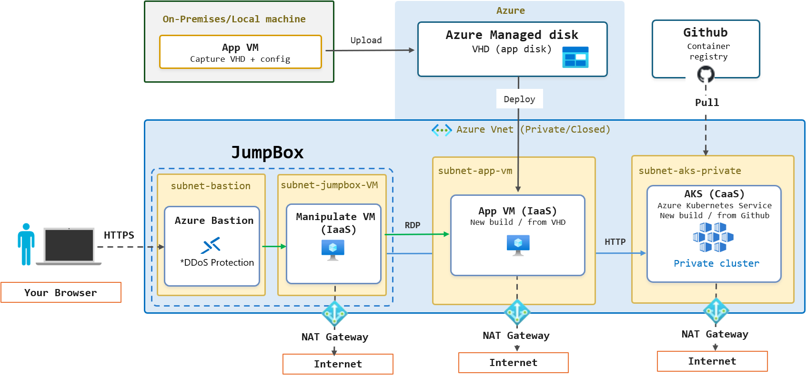
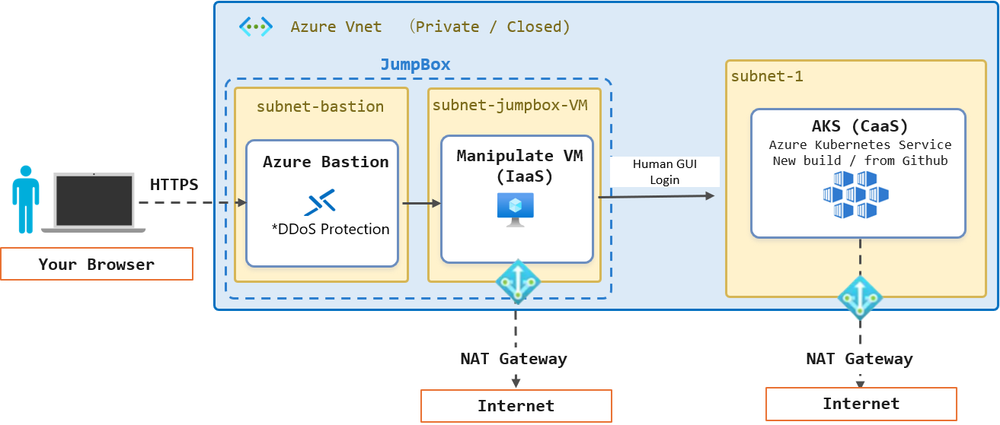
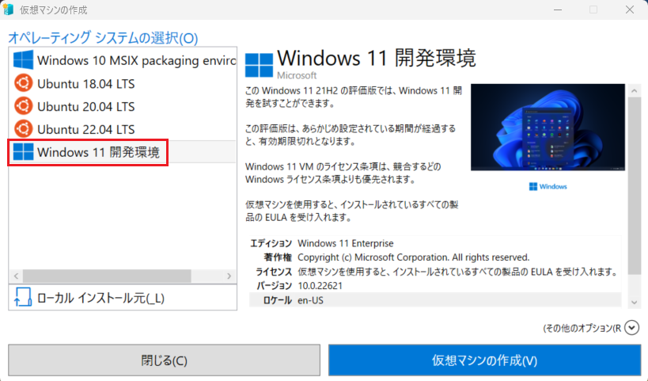
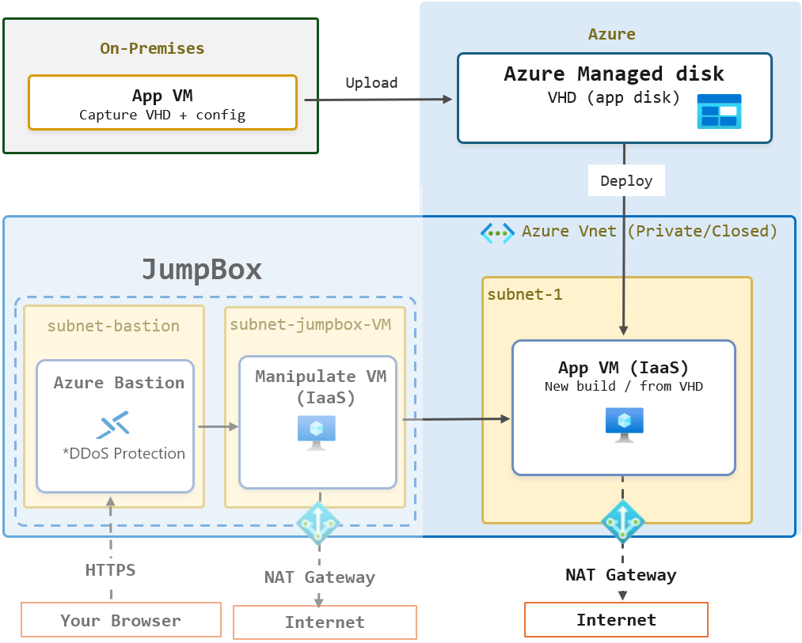
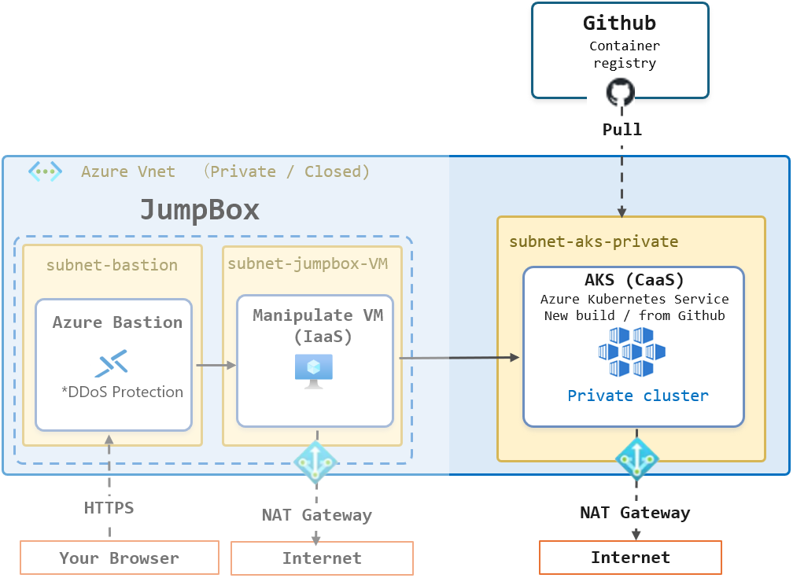

\[[In English](#building-an-isolated-azure-environment-for-lifting-and-shifting-an-existing-system-from-a-local-environment)\]

# ローカル環境から既存システムを Azure にリフトアンドシフトする際の閉域化環境の構築

ローカル環境やオンプレミス環境に存在する既存システムを Azure にリフトアンドシフトする際は、仮想ネットワークで閉域化された環境を構築することが推奨されます。このハンズオンでは、Azure 上における基本的な閉域化環境の構築手順を紹介します。

また、ローカル環境の仮想マシン (VHD、VHDX) を Azure 仮想マシンにリフトアンドシフトする手順についても紹介します。

# 概要

このハンズオンでは Azure 仮想ネットワークを使用して閉域化された環境を作成し、同閉域化環境内に Jump Box (踏み台サーバー) を構築します。さらに、ローカル環境の仮想マシンを Azure 仮想マシンにリフトアンドシフトする手順、閉域化環境への Azure Kubernetes Service (AKS) Private Cluster のデプロイ手順についても紹介します。

なお、実際の手順についてはパートごとに分割されたハンズオン資料を使用して実施し、このリポジトリは各ハンズオン資料へのポータルとして使用します。

# 前提条件

この手順を実施する前に、以下の前提条件を満たしている必要があります。

- Azure サブスクリプションが有効であること
- Azure ポータルにアクセスできること
- Azure の管理者権限か共同作成者の権限を持っていること

# この手順で構築される環境

単一の仮想ネットワーク内に、Jump Box (踏み台サーバー) と、ローカル環境からリフトアンドシフトされた Azure 仮想マシン、AKS Private Cluster が構築されます。

仮想ネットワーク内の Azure リソースに対しては Bastion を介した Jump Box のデスクトップを経由してのみアクセスおよび管理が可能となるため、セキュリティの高い閉域化環境を構築することができます。

また、このハンズオンでは触れませんが、この仮想ネットワークに対し、オンプレミス環境から VPN 接続や ExpressRoute 接続を行うことで、オンプレミス環境から Azure 環境への閉域接続を構築することができます。

# 手順

実際のハンズオンは以下のステップごとのリンクをクリックし、リンク先のハンズオン資料の内容に従って作業してください。

1. [**Azure 仮想ネットワークの作成と Jump Box のデプロイ**](https://github.com/osamum/HowtoMake-Az-JumpBox-Env)

    移行先環境となる Azure 仮想ネットワークを作成し、同仮想ネットワーク内に Jump Box (踏み台サーバー) をデプロイします。
    
    
    
    このハンズオンではすべての Azure リソースは同一リージョンを使用することを前提としているため、仮想ネットワークは 1 つですが、もし複数リージョンにまたがる環境を構築する場合は、各リージョンに仮想ネットワークを作成し、[仮想ネットワークピアリング](https://learn.microsoft.com/azure/virtual-network/virtual-network-peering-overview) を使用して接続し、[仮想ネットワーク リンク](https://learn.microsoft.com/azure/dns/private-dns-virtual-network-links) を使用して、正しく名前解決ができるように構成する必要があります。

2. [**ローカル環境の仮想マシン (VHDX) を Azure に移行するための準備**](https://github.com/osamum/Az_uploadPrep_vhd)

    この手順では、ローカル環境の仮想マシンのファイル (VHD、VHDX) を Azure 仮想マシンにリフトアンドシフトするための準備を行います。

    ハンズオンでは作業に使用する仮想マシンのファイルが存在している前提で記述されていますが、もし学習目的で実施するにあたり、仮想マシンのファイルが存在しない場合は、[\[**Hyper-V クイック作成**\]](https://learn.microsoft.com/virtualization/hyper-v-on-windows/quick-start/enable-hyper-v) から Windows 開発環境の仮想マシンを作成し、仮想マシンのファイルを取得することができます。ただし、この仮想マシンに既定で設定されているユーザーのパスワードは公開されていないので、別途、管理者権限を持つローカルアカウントを新規に作成してから作業を行ってください。

    

3. [**VHD ファイルの Azure へのアップロードと、それを使用した仮想ネットワーク内の閉域環境への仮想マシンの作成**](https://github.com/osamum/Howto-upload-VHD-to-Azure-and-create-VM-)

    手順 2 で準備した VHD ファイルを Azure にアップロードし、同 VHD ファイルを使用して仮想ネットワーク内に仮想マシンを作成します。デプロイされた仮想マシンへのアクセスは、Jump Box のデスクトップから RDP を使用して行います。

    

4. [**Azure の仮想ネットワークで閉域化された環境に Azure Kubernetes Service (AKS) を構築する**](https://github.com/osamum/HowtoDeploy_AKS_PrivateCluster)

    仮想ネットワーク内に AKS Private Cluster を構築します。AKS Private Cluster は、仮想ネットワーク内のプライベート IP アドレスを使用して AKS クラスターの API サーバーにアクセスするため、インターネット経由でのアクセスはできません。AKS Private Cluster の管理は、Jump Box のデスクトップから行います。

    ただし、クラスターからのインターネット接続は可能で、このハンズオンではアプリケーションは GitHub Container Registry (GHCR) に格納されている AKS デモアプリケーションのコンテナイメージを使用してデプロイします。

    

    もし、コンテナーレジストリも閉域化された環境内に構築したい場合は、別途 [Azure Container Registry (ACR) をデプロイ](https://learn.microsoft.com/azure/container-registry/container-registry-get-started-portal)し、[プライベートリンク](https://learn.microsoft.com/azure/container-registry/container-registry-private-endpoints) を作成して閉域化された環境内からアクセスできるように構成します。その後、ACR 側のネットワーク設定でパブリックネットワークからのアクセスを無効化すれば、閉域化された環境内でのみコンテナイメージを取得できるようになります。

 

# Building an Isolated Azure Environment for Lifting and Shifting an Existing System from a Local Environment

When lifting and shifting an existing system from a local or on-premises environment to Azure, we recommend building an environment isolated within a virtual network. This hands-on guide introduces the basic steps for building an isolated environment on Azure.

It also explains how to lift and shift a local virtual machine (VHD or VHDX) to an Azure virtual machine.

# Overview

In this hands-on guide, you will use Azure Virtual Network to create an isolated environment and deploy a jump box (bastion server) within it. You will also learn how to lift and shift a local virtual machine to an Azure virtual machine and deploy an Azure Kubernetes Service (AKS) private cluster in the isolated environment.

The actual procedures are divided into separate hands-on guides for each part. This repository serves as a portal to those guides.

# Prerequisites

Before starting, make sure that you meet the following prerequisites:

- You have an active Azure subscription.
- You can access the Azure portal.
- You have the Owner or Contributor role in Azure.

# Environment Built in This Guide

A jump box (bastion server), an Azure virtual machine lifted and shifted from a local environment, and an AKS private cluster will be deployed in a single virtual network.

Azure resources in the virtual network can be accessed and managed only from the jump box desktop through Azure Bastion, providing a highly secure, isolated network environment.

Although this hands-on guide does not cover the configuration, you can establish private connectivity from an on-premises environment to Azure by connecting the on-premises environment to this virtual network through a VPN or Azure ExpressRoute.

# Instructions

For each part of the hands-on exercise, select the corresponding link below and follow the instructions in the linked guide.

1. [**Create an Azure Virtual Network and Deploy a Jump Box**](https://github.com/osamum/HowtoMake-Az-JumpBox-Env)

    Create the Azure virtual network that will host the migrated environment, and deploy a jump box (bastion server) in the virtual network.

    

    This hands-on guide assumes that all Azure resources are deployed in the same region, so it uses a single virtual network. If you build an environment spanning multiple regions, create a virtual network in each region, connect them by using [virtual network peering](https://learn.microsoft.com/azure/virtual-network/virtual-network-peering-overview), and configure [virtual network links](https://learn.microsoft.com/azure/dns/private-dns-virtual-network-links) to ensure that names are resolved correctly.

2. [**Prepare a Local Virtual Machine (VHDX) for Migration to Azure**](https://github.com/osamum/Az_uploadPrep_vhd)

    In this step, you will prepare a local virtual machine file (VHD or VHDX) to lift and shift it to an Azure virtual machine.

    The guide assumes that you already have a virtual machine file to use. If you do not have one and are following the guide for learning purposes, you can create a Windows development environment virtual machine with [**Hyper-V Quick Create**](https://learn.microsoft.com/virtualization/hyper-v-on-windows/quick-start/enable-hyper-v) and obtain its virtual machine file. However, the password for the default user configured on this virtual machine is not publicly available. Before proceeding, create a separate local account with administrator privileges.

    

3. [**Upload a VHD File to Azure and Use It to Create a Virtual Machine in an Isolated Virtual Network**](https://github.com/osamum/Howto-upload-VHD-to-Azure-and-create-VM-)

    Upload the VHD file prepared in step 2 to Azure, and use it to create a virtual machine in the isolated virtual network. Access the deployed virtual machine from the jump box desktop by using RDP.

    

4. [**Deploy Azure Kubernetes Service (AKS) in an Isolated Azure Virtual Network**](https://github.com/osamum/HowtoDeploy_AKS_PrivateCluster)

    Deploy an AKS private cluster in the virtual network. Because an AKS private cluster's API server is accessed through a private IP address in the virtual network, it cannot be accessed over the internet. Manage the AKS private cluster from the jump box desktop.

    The cluster can still connect to the internet. In this hands-on guide, you will deploy an application by using the container image for an AKS demo application stored in GitHub Container Registry (GHCR).

    

    To deploy a container registry within the isolated environment as well, separately [deploy Azure Container Registry (ACR)](https://learn.microsoft.com/azure/container-registry/container-registry-get-started-portal) and create a [private link](https://learn.microsoft.com/azure/container-registry/container-registry-private-endpoints) so that it can be accessed from the isolated environment. Then disable public network access in the ACR network settings so that container images can be pulled only from within the isolated environment.
